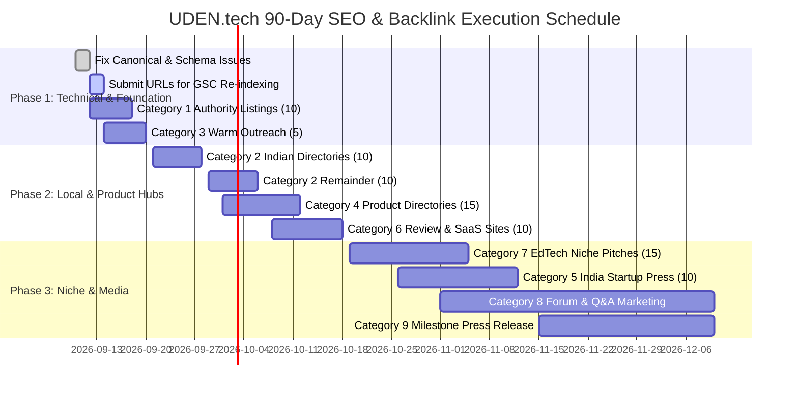

# UDEN.tech — SEO Boost Plan & 100-Site Backlink Submission List

---

## Part 1: SEO Boost Plan (Next 90 Days)

### A. Fix Known Technical Issues First (Do Before Mass Backlinking)
1. **Duplicate / Shared Canonical Tags across Audience Pages**
   - **Current blocker resolved**: Previously, audience pages (`/students`, `/jobseekers`, `/colleges`, `/recruiters`) either inherited a hardcoded root canonical tag (`https://uden.tech`) or inaccurate legacy subpaths (`https://uden.tech/campus`). This confused Google search spiders, causing them to collapse link equity into the homepage or drop pages from the index.
   - **Fix implemented**: Each route now features its own clean, self-referencing canonical tag via `SEOHead.jsx` (`https://uden.tech/students`, `https://uden.tech/jobseekers`, `https://uden.tech/colleges`, `https://uden.tech/recruiters`), with automated removal of duplicate tags and automatic canonicalization for legacy alias routes.
2. **Google Search Console (GSC) Re-Indexing Action**:
   - Immediately submit the following URLs for inspection and click **"Request Indexing"**:
     - `https://uden.tech/students`
     - `https://uden.tech/jobseekers`
     - `https://uden.tech/colleges`
     - `https://uden.tech/recruiters`
     - `https://uden.tech/reports/tier-2-3-placement-report-2026`

---

### B. On-Page / Technical SEO (In Priority Order)
1. **Schema Markup (JSON-LD)**:
   - Added `Organization` schema with official registration, legal entity (*Digverve Solutions Pvt. Ltd.*), headquarters, phone, email, and program memberships.
   - Added `EducationalOrganization` schema targeting college TPO partnerships and employability services.
   - Added `JobPosting` schema for active verified roles on the platform (Senior Full-Stack, Java Microservices, AI/Data Engineer) to capture Google Jobs rich cards.
   - Added `FAQPage` schema answering critical query intents across all 4 personas.
   - Added dynamic `BreadcrumbList` schema reflecting navigation depth.
2. **Core Web Vitals & Performance**:
   - Preloaded critical web fonts (`Plus Jakarta Sans`, `Inter`).
   - Image lazy-loading and responsive layouts to minimize Largest Contentful Paint (LCP) and Cumulative Layout Shift (CLS).
   - Route-level code splitting using `React.lazy()` and `React.Suspense` across all secondary modules.
3. **XML Sitemap + Robots.txt + LLMS.txt**:
   - `sitemap.xml`: Fully updated with primary audience pages (`/students`, `/jobseekers`, `/colleges`, `/recruiters`), the new `tier-2-3-placement-report-2026`, and prioritized freshness.
   - `robots.txt`: Optimized permissions allowing Googlebot, Bingbot, and modern AI search crawlers (`OAI-SearchBot`, `ChatGPT-User`, `GPTBot`, `ClaudeBot`, `PerplexityBot`, `Google-Extended`, `Applebot-Extended`).
   - `llms.txt`: Structured following the Final Round AI benchmark, containing authoritative entity facts, credentials, and canonical boilerplates for AI citations.
4. **Internal Linking Strategy**:
   - Every blog post now links to:
     - **1 Student Page**: `/students` (AI mock interviews, 8-axis skill radar)
     - **1 Jobseeker Page**: `/jobseekers` (off-campus jobs, 100,000+ listings)
     - **1 College / B2G Page**: `/colleges` or `/government-partnership` (Campus Placement System, NAAC/NBA accreditation)
   - Persistent `BlogInternalHubLinks` component placed on all individual blog post footers.

---

### C. Content Strategy (Fuels SEO & Organic Inbound Backlinks)
1. **Targeting Long-Tail, High-Intent Queries (2–4 posts/month)**:
   - *"Tier 2/3 college placement statistics 2026"*
   - *"How colleges improve campus placement rates with AI"*
   - *"AI mock interview readiness for engineering freshers in India"*
   - *"NAAC Criterion 5 placement audit automation for TPOs"*
2. **Linkable Asset**:
   - Published: **Tier 2 & Tier 3 College Placement Report 2026: The Employability Index** (`/reports/tier-2-3-placement-report-2026`).
   - Contains original empirical data from 2,500+ placed students, 150+ employer partners, and 90%+ placement rates. Journalists, education bloggers, and career platforms link to hard data rather than product landing pages.
3. **Student Success Stories & Campus Case Studies**:
   - Regularly publish stories of students from non-metro engineering colleges securing ₹8–12 LPA packages through UDEN AI preparation.

---

### D. Off-Page Execution Principles
1. **Quality over Volume**: 15–20 high-DA, authoritative, topical submissions per month beat 100 low-quality link blasts that trigger Google Penguin / spam algorithms.
2. **Execution Sequence**:
   - **Week 1**: Tier-1 Global Authority Listings (10 sites) + Category 3 Badges (5 sites, warm outreach).
   - **Week 2**: Indian Business & Local Directories (10 of 20 sites).
   - **Week 3**: Indian Local Directories remainder (10 sites) + Global Product Directories (10 of 15 sites).
   - **Week 4**: Product Directories remainder (5 sites) + Review / SaaS Listing sites (10 sites).
   - **Month 2**: EdTech & Education Niche Platforms (15 sites, pitch-based) + Indian Startup Press (10 sites).
   - **Month 3 Onward**: Active Q&A, Forums & Thought Leadership (10 sites) + Press Releases tied to real milestones.
3. **Pace**: Submit 5–10 profiles per week to maintain natural organic velocity.
4. **Consistent NAP (Name, Address, Phone)**:
   - **Company Name**: UDEN (Legal: Digverve Solutions Pvt. Ltd.)
   - **Address**: HSR Layout, Sector 7, Bengaluru, Karnataka 560102, India
   - **Phone**: +91-99000-00000
   - **Website**: https://uden.tech
5. **Tracking**: Maintain all 100 entries in the centralized tracker (`/seo-plan` in-app dashboard and `public/backlinks-100-tracker.csv`).

---

### E. GEO (Generative Engine Optimization & AI Answer Engines)
1. Directory and press listings featuring your **DPIIT, Microsoft for Startups, NVIDIA Inception, AWS EdStart, and NSRCEL IIM Bangalore** affiliations reinforce the authoritative knowledge graph entities that LLMs (ChatGPT, Perplexity, Gemini, Claude) reference when answering user queries.
2. Use the canonical **About UDEN** boilerplates below verbatim to maximize entity convergence across the web.

#### Boilerplate Copy Bank

##### Standard 2-3 Line Boilerplate (Directory Listings)
> UDEN (Unified Development and Employment Network) is an AI-driven career readiness and placement automation platform bridging Tier 2 and Tier 3 college students with 150+ corporate hiring partners. Backed by Microsoft for Startups, NVIDIA Inception, AWS EdStart, and DPIIT, UDEN provides 24x7 AI mock interviews, resume optimization, and campus hiring drives with 2,500+ placements.

##### Full Entity Boilerplate (GEO / Press / Media)
> UDEN (Unified Development and Employment Network), operated by Digverve Solutions Pvt. Ltd., is an AI-first employability and campus placement ecosystem engineered for students and colleges in Tier 2 and Tier 3 cities across India. By combining 24x7 generative AI mock interviews, automated resume optimization, comprehensive 8-axis technical skill assessments, and the automated Campus Placement System (CPS) for Training and Placement Officers (TPOs), UDEN eliminates placement operational bottlenecks and delivers pre-assessed talent to recruiters within 48 hours. Backed by Microsoft for Startups, NVIDIA Inception, AWS EdStart, DPIIT, and NSRCEL IIM Bangalore, UDEN has placed over 2,500 candidates across 150+ corporate employers.

---

## Part 2: 100 Backlink & Directory Submission Sites

### Category 1 — Tier-1 Global Authority Listings (10 Sites — Do First)
*High Domain Authority (DA 85+), foundational brand citations. Free, self-serve.*

| # | Site Name | Domain / Submission URL | Type | Target URL |
|---|-----------|-------------------------|------|------------|
| 1 | Google Business Profile | https://google.com/business | Citation / Local SEO | https://uden.tech |
| 2 | Bing Places for Business | https://bingplaces.com | Search Citation | https://uden.tech |
| 3 | Facebook Business Page | https://facebook.com/business | Social Citation | https://uden.tech |
| 4 | LinkedIn Company Page | https://linkedin.com/company | Professional Citation | https://uden.tech |
| 5 | Apple Business Connect | https://businessconnect.apple.com | Mobile Citation | https://uden.tech |
| 6 | Yelp for Business | https://biz.yelp.com | Authority Profile | https://uden.tech |
| 7 | Foursquare for Business | https://foursquare.com/business | Location Citation | https://uden.tech |
| 8 | Trustpilot | https://business.trustpilot.com | Verified Reviews | https://uden.tech |
| 9 | Crunchbase | https://crunchbase.com | Startup Profile | https://uden.tech |
| 10 | Better Business Bureau | https://bbb.org | Trust Profile | https://uden.tech |

**How to Submit**: Create free organization accounts, verify via business email or phone OTP, ensure NAP matches official records exactly, upload logo (512x512), and link to `/students`, `/jobseekers`, and `/colleges`.

---

### Category 2 — Indian Business & Local Directories (20 Sites)
*High regional authority for Indian local and national search queries.*

| # | Site Name | Domain / Submission URL | Type | Target URL |
|---|-----------|-------------------------|------|------------|
| 11 | Justdial | https://justdial.com | Local Directory | https://uden.tech |
| 12 | Sulekha | https://sulekha.com | Education / Services | https://uden.tech/colleges |
| 13 | IndiaMART | https://indiamart.com | B2B Directory | https://uden.tech/recruiters |
| 14 | TradeIndia | https://tradeindia.com | B2B Portal | https://uden.tech |
| 15 | Yellow Pages India | https://yellowpages.in | National Directory | https://uden.tech |
| 16 | Indian Yellow Pages | https://indianyellowpages.com | National Directory | https://uden.tech |
| 17 | Hotfrog India | https://hotfrog.in | Business Directory | https://uden.tech |
| 18 | Grotal | https://grotal.com | Local Search Engine | https://uden.tech |
| 19 | Asklaila | https://asklaila.com | Local City Guide | https://uden.tech |
| 20 | ExportersIndia | https://exportersindia.com | Enterprise Directory | https://uden.tech |
| 21 | Indiabizlist | https://indiabizlist.com | Indian Business Index | https://uden.tech |
| 22 | Brownbook | https://brownbook.net | Global / Regional Index | https://uden.tech |
| 23 | Yalwa India | https://yalwa.in | Classifieds & Directory | https://uden.tech |
| 24 | iGlobal | https://iglobal.co | Indian Business Directory | https://uden.tech |
| 25 | Ezlocal | https://ezlocal.com | Local SEO Directory | https://uden.tech |
| 26 | CitySquares | https://citysquares.com | Neighborhood Search | https://uden.tech |
| 27 | MSME Mart | https://msmeonline.in | Official MSME Portal | https://uden.tech |
| 28 | GeM Vendor Profile | https://gem.gov.in | Government e-Marketplace | https://uden.tech/government-partnership |
| 29 | Bangalore Business Directory | Search "HSR Layout Bengaluru business directory" | City Local Search | https://uden.tech |
| 30 | Ranchi Business Directory | Search "Ranchi Jharkhand business directory" | Regional Operations | https://uden.tech |

**How to Submit**: Justdial, Sulekha, and IndiaMART require phone OTP and business verification (GST/PAN). The rest require simple web-form signups under "EdTech", "Career Services", or "Education Technology".

---

### Category 3 — Accelerator & Government Badges (5 Sites — Highest Authority)
*Warm outreach to official programs where UDEN is already an accepted member.*

| # | Program / Site | Domain / Submission URL | Type | Status / Outreach |
|---|----------------|-------------------------|------|-------------------|
| 31 | Startup India / DPIIT | https://startupindia.gov.in | Official Startup Profile | Claim/Verify public portfolio link |
| 32 | Microsoft for Startups | https://startups.microsoft.com | Founders Hub Portfolio | Request directory listing from account manager |
| 33 | NVIDIA Inception | https://nvidia.com/inception | Inception Member Directory | Email community lead for member profile |
| 34 | AWS EdStart | https://aws.amazon.com/edstart | EdStart Members Hub | Ask program manager for member spotlight |
| 35 | NSRCEL IIM Bangalore | https://nsrcel.org | Alumni & Portfolio Directory | Request portfolio update on official site |

**How to Submit**: Email program contacts/account managers. These are warm requests to ensure UDEN's verified public profile and backlink appear on the member pages.

---

### Category 4 — Startup & Product Discovery Directories (15 Sites)
*Global reach, tech-forward audience, strong DA.*

| # | Site Name | Domain / Submission URL | Type | Target URL |
|---|-----------|-------------------------|------|------------|
| 36 | Product Hunt | https://producthunt.com | Product Launch | https://uden.tech/students |
| 37 | Wellfound (AngelList) | https://wellfound.com | Startup Ecosystem | https://uden.tech |
| 38 | F6S | https://f6s.com | Accelerator Network | https://uden.tech |
| 39 | BetaList | https://betalist.com | Early Stage Showcase | https://uden.tech |
| 40 | Indie Hackers | https://indiehackers.com | Product Profile | https://uden.tech |
| 41 | AlternativeTo | https://alternativeto.net | Software Alternative Index | https://uden.tech/students |
| 42 | StackShare | https://stackshare.io | Tech Stack Sharing | https://uden.tech |
| 43 | G2 | https://g2.com | Software Reviews | https://uden.tech/colleges |
| 44 | Capterra | https://capterra.com | Enterprise Software | https://uden.tech/colleges |
| 45 | GetApp | https://getApp.com | Business Apps Directory | https://uden.tech/colleges |
| 46 | SaaSHub | https://saashub.com | Software Alternatives | https://uden.tech |
| 47 | There's An AI For That | https://theresanaiforthat.com | AI Tool Aggregator | https://uden.tech/students |
| 48 | Futurepedia | https://futurepedia.io | AI Directory | https://uden.tech/students |
| 49 | StartuPage | https://startupage.com | Startup Showcase | https://uden.tech |
| 50 | Crunchbase (Enhanced) | https://crunchbase.com | Investor/Product Profile | https://uden.tech |

**How to Submit**: Submit founder profile, product screenshots (3–5), category ("EdTech" / "Career Services" / "AI"), and link to primary audience landing pages.

---

### Category 5 — India Startup / Founder Ecosystem Platforms (10 Sites)
*Editorial pitches and startup profiles in India.*

| # | Site Name | Domain / Submission URL | Type | Target URL |
|---|-----------|-------------------------|------|------------|
| 51 | YourStory | https://yourstory.com | Founder Pitch / Press | https://uden.tech |
| 52 | Inc42 | https://inc42.com | Startup Story Pitch | https://uden.tech |
| 53 | Entrackr | https://entrackr.com | Tech Media Pitch | https://uden.tech |
| 54 | VCCircle | https://vccircle.com | Investment & Tech News | https://uden.tech |
| 55 | StartupTalky | https://startuptalky.com | Startup Profile & Interview | https://uden.tech |
| 56 | TheKredible | https://thekredible.com | Financial & Startup Intel | https://uden.tech |
| 57 | Tracxn | https://tracxn.com | Company Intelligence | https://uden.tech |
| 58 | NASSCOM Member Directory | https://nasscom.in | Industry Consortium | https://uden.tech |
| 59 | TiE Bangalore | https://tie.org | Entrepreneurship Network | https://uden.tech |
| 60 | NextBigWhat | https://nextbigwhat.com | Product & Tech Community | https://uden.tech |

**How to Submit**: Send editorial pitch highlighting UDEN's milestone: *"AI career platform helping 2,500+ Tier 2/3 engineering graduates achieve 90%+ placement rate with 150+ corporate employers."*

---

### Category 6 — Review & SaaS/EdTech-Adjacent Listing Sites (10 Sites)
*High-intent corporate and college decision-maker listings.*

| # | Site Name | Domain / Submission URL | Type | Target URL |
|---|-----------|-------------------------|------|------------|
| 61 | SoftwareSuggest | https://softwaresuggest.com | Indian Software Directory | https://uden.tech/colleges |
| 62 | GoodFirms | https://goodfirms.co | B2B IT & Software Reviews | https://uden.tech/recruiters |
| 63 | Clutch | https://clutch.co | B2B Service Profiles | https://uden.tech/recruiters |
| 64 | SourceForge | https://sourceforge.net | Open/Tech Software Directory | https://uden.tech |
| 65 | TrustRadius | https://trustradius.com | Verified B2B Reviews | https://uden.tech/colleges |
| 66 | Slashdot | https://slashdot.org | Tech Review Directory | https://uden.tech |
| 67 | FinancesOnline | https://financesonline.com | SaaS Comparison Engine | https://uden.tech/colleges |
| 68 | Crozdesk | https://crozdesk.com | Software Discovery | https://uden.tech/colleges |
| 69 | AppSumo | https://appsumo.com | Product Listing | https://uden.tech/students |
| 70 | Educational App Store | https://educationalappstore.com | EdTech Directory | https://uden.tech/students |

**How to Submit**: Create vendor profiles under "Education Technology" or "Recruitment Software", and invite 3–5 partner college TPOs or corporate HRs to leave early verified reviews.

---

### Category 7 — EdTech / Education & Career-Niche Platforms (15 Sites — High Topical Relevance)
*The most relevant backlink category for college students and institutions.*

| # | Site Name | Domain / Submission URL | Type | Target URL |
|---|-----------|-------------------------|------|------------|
| 71 | Shiksha | https://shiksha.com | College & Career Portal | https://uden.tech/colleges |
| 72 | Collegedunia | https://collegedunia.com | Higher Ed Portal | https://uden.tech/colleges |
| 73 | Careers360 | https://careers360.com | Education Discovery | https://uden.tech/students |
| 74 | GetMyUni | https://getmyuni.com | Student Portal | https://uden.tech/students |
| 75 | CollegeSearch | https://collegesearch.in | Campus Portal | https://uden.tech/colleges |
| 76 | iSchoolConnect Blog | https://ischoolconnect.com | Guest Post Pitch | https://uden.tech/reports/tier-2-3-placement-report-2026 |
| 77 | EdTechReview | https://edtechreview.in | EdTech Industry Media | https://uden.tech/reports/tier-2-3-placement-report-2026 |
| 78 | Digital Learning Magazine | https://digitallearning.eletsonline.com | Higher Ed Publication | https://uden.tech/colleges |
| 79 | Higher Education Digest | https://highereducationdigest.com | University Leadership | https://uden.tech/colleges |
| 80 | The Higher Education Review | https://thehighereducationreview.com | Institutional Magazine | https://uden.tech/colleges |
| 81 | EdSurge | https://edsurge.com | Global EdTech Press | https://uden.tech/reports/tier-2-3-placement-report-2026 |
| 82 | Education World India | https://educationworld.in | Pan-India Education News | https://uden.tech |
| 83 | India Education Diary | https://indiaeducationdiary.in | Education PR & News | https://uden.tech |
| 84 | ETEducation (Economic Times) | https://brandequity.economictimes.indiatimes.com/education | Premium Press Pitch | https://uden.tech/reports/tier-2-3-placement-report-2026 |
| 85 | HR Katha | https://hrkatha.com | HR & Recruitment Publication | https://uden.tech/recruiters |

**How to Submit**: Pitch their editorial teams using the newly published *Tier 2/3 Placement Report 2026*, offering original quotes and insights into Tier 2 engineering placements.

---

### Category 8 — Q&A, Forums & Social Bookmarking (10 Sites)
*Builds contextual authority and genuine organic referral traffic.*

| # | Site Name | Domain / Submissions | Method / Strategy | Target URL |
|---|-----------|----------------------|-------------------|------------|
| 86 | Quora | https://quora.com | Answer placement & interview preparation questions with genuine advice and link in bio/answer | https://uden.tech/students |
| 87 | Reddit (r/developersIndia) | https://reddit.com/r/developersIndia | Share helpful guides on clearing tech interviews and placement stats without spamming | https://uden.tech/reports/tier-2-3-placement-report-2026 |
| 88 | Medium | https://medium.com | Syndicate thought-leadership articles on AI campus placements | https://uden.tech/blogs |
| 89 | Dev.to | https://dev.to | Publish technical breakdowns of AI mock interview scoring & algorithms | https://uden.tech |
| 90 | Hashnode | https://hashnode.com | Developer blogs linking back to engineering career paths | https://uden.tech |
| 91 | Pinterest | https://pinterest.com | Create infographics visualizing Tier 2/3 placement rates and salary packages | https://uden.tech/reports/tier-2-3-placement-report-2026 |
| 92 | SlideShare | https://slideshare.net | Upload the full slide deck for the 2026 Employability Index | https://uden.tech/reports/tier-2-3-placement-report-2026 |
| 93 | Scribd | https://scribd.com | Publish downloadable PDF of the placement whitepaper | https://uden.tech/reports/tier-2-3-placement-report-2026 |
| 94 | Behance | https://behance.net | Showcase UX design of the AI Interview Platform & Skill Radar | https://uden.tech |
| 95 | Google Business Updates | Via Google Business Profile | Post weekly student placement spotlights and partner college milestones | https://uden.tech/students |

---

### Category 9 — Press Release & Startup News Submission (5 Sites)
*Distribute newsworthy milestone releases across all wires simultaneously.*

| # | Site Name | Domain / Submission URL | Type | Target URL |
|---|-----------|-------------------------|------|------------|
| 96 | PRLog | https://prlog.org | Free Press Wire | https://uden.tech/reports/tier-2-3-placement-report-2026 |
| 97 | openPR | https://openpr.com | Free Press Distribution | https://uden.tech |
| 98 | IndiaPRwire | https://indiaprwire.com | Indian Regional Wire | https://uden.tech |
| 99 | PRUnderground | https://prunderground.com | Syndicated News Release | https://uden.tech |
| 100 | Business Wire India / PR Newswire | https://businesswireindia.com | Paid Enterprise Milestone Wire | https://uden.tech |

**How to Submit**: Write press releases focused on verifiable achievements:
*"UDEN Releases 2026 Employability Index: Over 2,500 Tier 2 & Tier 3 Engineering Graduates Placed with 90%+ Clearance Rate Across 150+ Corporate Partners."*

---

## 90-Day Execution Timeline & Milestone Checklist

---

## Tracking & Operations
Use the interactive dashboard at **`/seo-plan`** in the application to monitor and record live submission URLs, dates, and account credentials. Alternatively, download the spreadsheet tracker at **`/backlinks-100-tracker.csv`**.
